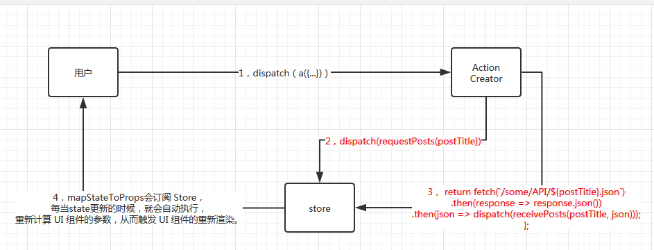
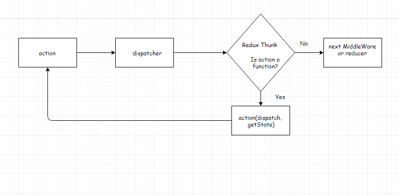

## 一，环境配置
1，node： 8.11.4

2，webpack & less 

3，插件类：swiper

## 二，遇到的问题
##### (√)1, babel-loader是8.0，babel-core是6.0，版本号不匹配构建失败

##### (√)2，react实时渲染；eg：倒计时

利用组件的api --> 设置状态：setState

setInterval要bind(this)

##### (√)3,嵌套组件渲染问题--div标签；eg:倒计时

return 的不能是字符串，应该是react格式的html文档

##### 4，vw和px转换

##### (√)5, 推荐商品模板渲染不出来
原因：箭头函数后面加了{}
解决方案：去掉{}

##### (√)6，引入react-router控制台报错'location' of undefined

原因：React Router被拆分成三个包：react-router,react-router-dom和react-router-native，目前网站搭建只需要引入react-router-dom即可； 路由器组件无法接受两个及以上的子元素；
解决方案：引入react-router-dom

##### (√)7,子路由刷新 404？
eg：127.0.0.1:8080/bag

解决方案：webpack配置中devServer中加上historyApiFallback:true

##### (√)8,样式引入
 三目运算，结果包含多个类 
 `
 标题 
 `
 
 // 使用数组的join方法组合class 
 `
此标签是否选中
 `
 
 // 使用`${}`字符串运算 
 `
此标签是否选中
`
 
 // style方式
 `
slider1
`
 
 ##### (√)9,react map渲染json数据
 return里面用不了json，抽离成组件，在组件中使用
 
 ##### (√)10, webpack 构建的问题？
 (√)10.1，HtmlWebpackPlugin插件生成是index.html不是指定模板生成的，没有id为root的div？
 原因：filename值写错了，写成了路径
 
 (√)10.2，构建html-webpack-plugin 报错 Entrypoint undefined = index.html，
 错误不影响，不管
 
##### (√)11，container和components混在了一起
见：12.2解释

##### 12,redux相关问题
(√)12.1，components中的数据来自哪里?

来自于容器组件container的mapStateToProps

延时问题：多个数据和多个事件怎么传递？

json字符串的方式传递

事件一个一个写在mapDispatchToProps中

(√)12.2，redux目录
components：ui组件，只负责展示，通过connect方法关联

container：容器组件，负责数据管理和逻辑，通过connect方法关联

reducer：Store 收到 Action 以后，必须给出一个新的 State，这样 View 才会发生变化。这种 State 的计算过程就叫做 Reducer。可通过store.dispatch自动执行reducer

actions：Action 就是 View 发出的通知，View 要发送多少种消息，就会有多少种 Action。里面存放的都是Action Creator

路由渲染的是：components 组件

(√)12.3，redux逻辑
view（AddTodo.js）出发点击事件,通过dispatch(action[名称：addTodo])自动执行reducer，把数据存入store中。

view展示层，通过visibeltodoList.js的mapStateToProps方法拿到state的数据，传给demo.todolist.list.js

(√)12.4,combineReducers

把多个reducer合并成一个大的reducer，这样store的目录就清晰有层次。

(√)12.5，store.subscribe的方法在此项目中是如何体现的？

mapStateToProps会订阅 Store，每当state更新的时候，就会自动执行，重新计算 UI 组件的参数，从而触发 UI 组件的重新渲染。

(√)12.6，cart和checkout两个页面之间如果传递store
解决方案：都加载到store里面

12.7，redux 如何根据需要加载，用完自动释放？

可以通过loadSonReducer.service.jd自动加载子reducer，至于按需加载，实时释放有待考虑调研。

##### 13，redux-thunk
(√)1，一个异步请求action包含三个状态：请求中、请求成功，请求失败。

(√)2，整个异步操作的思路：
  
**操作开始时，送出一个 Action，触发 State 更新为"正在操作"状态，View 重新渲染。

**操作结束后，再送出一个 Action，触发 State 更新为"操作结束"状态，View 再一次重新渲染。
  
(跟发送ajax请求思想一样)

(√)3，redux-thunk的发送步骤

 
 

## 旅程

1，页面初步跑起来。(√)

2，引入webpack(√)

3，引入less、swiper(√)

4，引入路由(√)

5，引入redux(√)

6, 异步请求redux-thunk(√)

7，引入模板(√)

8，引入测试用例

## 页面功能
1，首页
倒计时，banner滚动，不规则瀑布流

2,类目

3，购物车
购物车商品数量更改（redux），
异步下单（redux-thunk）

4，个人中心